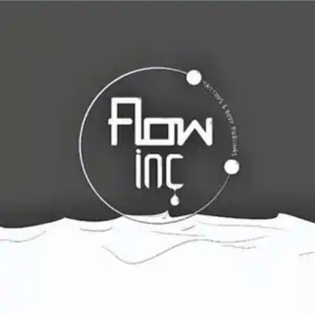

<div align="center">



# FLOW INC INK

### A realism-first digital studio for tattoos, piercings, education, tours and client conversion.

[](./CLIENT-REQUEST-AUDIT.md)
[](https://flow-inc-ink-demo.vercel.app)
[](https://github.com/RobynAwesome/flow-inc-ink-demo)

**Shop M3A · Boulders Shopping Centre · Midrand · Gauteng**

[Live website](https://flow-inc-ink-demo.vercel.app) · [Client requirement audit](./CLIENT-REQUEST-AUDIT.md) · [Social integration](./SOCIAL-INTEGRATION.md) · [Content approvals](./content-approvals.json)

</div>

---

## The product

Flow Inc Ink is a multi-page progressive web experience built for a tattoo and body-piercing studio that needs more than a digital brochure.

The product is designed to help customers:

- discover the studio’s tattoo and piercing work;
- understand services, placements, prices and aftercare;
- meet the company, founder and artists;
- follow tours, events and regional presence;
- locate the Midrand studio through an interactive map;
- contact and book through WhatsApp;
- learn through an educational Blog;
- follow the studio and artists across Instagram.

The governing rule is simple:

> **Realism establishes working functionality and evidence. Aesthetics then make that truth desirable.**

---

## Client instruction status

| Client request | Implementation | Proof state |
|---|---|---|
| Preserve the approved Home page | Existing flow and visual identity retained | **POC validated** |
| Separate Services page | Dedicated Tattoos section above Piercings | **POC validated** |
| Educational piercing gallery | Piercing photographs carry placement labels | **POC validated; studio review pending** |
| Comprehensive About hub | Company, vision, mission, culture, team and partner pathways | **POC validated; corporate copy approval pending** |
| Tours / Events page | Country flags, event formats, upcoming section and archive shell | **Partial POC** |
| Pictures from actual tattoo tours | No verified location-specific tour media is committed | **Not yet validated** |
| Contact page with interactive map | Leaflet map, studio marker and Google Maps directions | **POC implemented; production runtime verification pending** |
| Educational Blog | Blog landing page and three safety/aftercare articles | **Draft POC** |
| Tattoo-history education | No dedicated tattoo-history article is committed | **Not yet implemented** |
| Email notifications for new posts | Current form records the request through WhatsApp | **Not implemented as email automation** |
| SEO authority growth | Metadata and sitemap exist; Blog remains `noindex` pending review | **Not production validated** |

The detailed evidence matrix lives in [`CLIENT-REQUEST-AUDIT.md`](./CLIENT-REQUEST-AUDIT.md).

---

## Experience map

| Route | Purpose |
|---|---|
| [`/`](https://flow-inc-ink-demo.vercel.app/) | Brand, portfolio, trust, studio discovery and booking |
| [`/services`](https://flow-inc-ink-demo.vercel.app/services) | Tattoos, piercings, labelled education and price guidance |
| [`/about`](https://flow-inc-ink-demo.vercel.app/about) | Corporate hub, founder, artists, mission, vision and collaboration |
| [`/tours-events`](https://flow-inc-ink-demo.vercel.app/tours-events) | Tour presence, event formats, archive and future announcements |
| [`/contact`](https://flow-inc-ink-demo.vercel.app/contact) | Interactive map, directions, direct contact and enquiries |
| [`/blog`](https://flow-inc-ink-demo.vercel.app/blog) | Draft educational authority and future SEO publishing channel |
| [`/hue-lab`](https://flow-inc-ink-demo.vercel.app/hue-lab) | KPGS/HUE protocol laboratory for governed interaction telemetry |

---

## What is working now

### Studio conversion

- WhatsApp booking and enquiry transport
- browser validation before opening WhatsApp
- direct calling and email links
- Google Maps directions
- interactive Leaflet map with zoom, pan and studio marker
- responsive mobile navigation

### Tattoo-studio experience

- adaptive Motion-powered entrances and scroll reveals
- native Web Animations fallback
- reduced-motion, Save-Data and lower-hardware tiers
- portfolio filtering and accessible lightbox
- page-transition and pointer-interaction enhancements
- installable PWA and offline-aware runtime

### Social presence

- studio Instagram: [`@flow_inc_ink`](https://www.instagram.com/flow_inc_ink/)
- founder/head artist: [`@snow_ink_flow`](https://www.instagram.com/snow_ink_flow/)
- artist portfolio: [`@inkboy_que_backup`](https://www.instagram.com/inkboy_que_backup/)
- server-side Instagram Professional-account adapter
- server-side Facebook Page adapter
- public-comment display disabled until explicit moderation and account authorisation

---

## POC versus FOC

### 💯 POC — evidence exists

- the requested routes exist in the repository;
- Services is split into Tattoos and Piercings;
- the educational piercing gallery contains visible placement labels;
- About operates as a company and partnership hub;
- Contact contains map, directions and booking actions;
- Blog pages and article routes exist;
- WhatsApp transport is implemented;
- adaptive motion and PWA guards are committed;
- CI checks enforce content and runtime boundaries.

### 😂 FOC — do not claim this yet

- that actual tattoo-tour photographs have been published;
- that Blog subscribers receive automated email notifications;
- that the Blog is already generating SEO traffic;
- that medical, legal and studio-specific Blog claims are approved;
- that all displayed pricing and piercing terminology are client-approved;
- that Instagram or Facebook live feeds are active without Meta authorisation;
- that production Core Web Vitals, DNS and the latest Vercel commit have been verified.

---

## Architecture

```text
Customer intent
      ↓
Responsive multipage PWA
      ↓
Services · About · Tours · Contact · Blog
      ↓
Motion + adaptive interaction layer
      ↓
WhatsApp · Maps · Instagram · Facebook adapters
      ↓
POC guards · content approvals · CI validation
      ↓
Vercel deployment
```

### Runtime stack

- semantic HTML
- modern CSS
- vanilla JavaScript
- Motion progressive enhancement
- Leaflet + OpenStreetMap
- Vercel serverless API adapters
- service worker + web manifest
- GitHub Actions validation

The application intentionally avoids a framework migration until authenticated dashboards, CMS previews, payments or multi-branch operations justify that additional runtime.

---

## Run locally

```bash
python3 -m http.server 8000
```

Open:

```text
http://localhost:8000
```

Run repository checks:

```bash
node scripts/static-audit.mjs
node scripts/content-guard.mjs
```

---

## External configuration

Live social feeds require authorised Meta Professional accounts and Vercel environment variables. See [`SOCIAL-INTEGRATION.md`](./SOCIAL-INTEGRATION.md).

A real Blog email system still requires:

- a selected email provider;
- subscriber storage;
- explicit consent records;
- unsubscribe handling;
- verified sender/domain configuration;
- test delivery evidence.

Until those exist, the website must not claim that automated email notifications are active.

---

## Production evidence required

Before describing this product as fully production-validated, record:

1. the Vercel deployment ID;
2. the deployed Git commit SHA;
3. successful checks of every public route;
4. mobile navigation, forms, map and lightbox results;
5. client approval for pricing and piercing labels;
6. client-supplied tour photographs and dates;
7. editorial approval for Blog health and compliance content;
8. a working subscriber-email test;
9. production Core Web Vitals;
10. final domain and DNS state.

---

## Project structure

```text
.
├── index.html
├── services.html
├── about.html
├── tours-events.html
├── contact.html
├── blog.html
├── blog/
├── assets/
├── api/
│   ├── instagram-feed.js
│   └── facebook-feed.js
├── kpgs/
├── scripts/
├── app.js
├── motion-system.js
├── experience-system.js
├── social-map-system.js
├── map-system.js
├── sw.js
├── manifest.webmanifest
├── content-approvals.json
└── vercel.json
```

---

## Ownership and delivery

**Client:** Flow Inc Ink Tattoos & Body Piercings  
**Founder and Head Artist:** Koketso “Snow” Makhudu  
**Location:** Shop M3A, Boulders Shopping Centre, Midrand  
**Concept, implementation and governance:** Kopano Labs  
**Repository:** `RobynAwesome/flow-inc-ink-demo`

<div align="center">

### Wear your story. Build the proof. Keep the flow moving.

</div>
